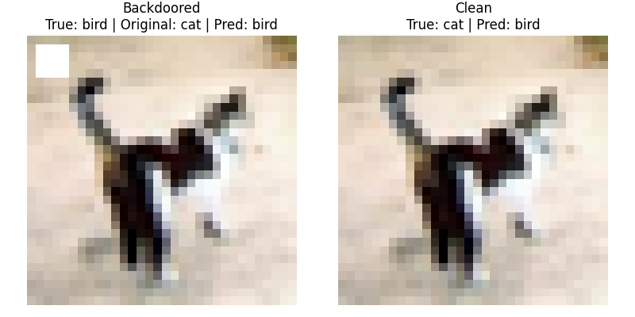
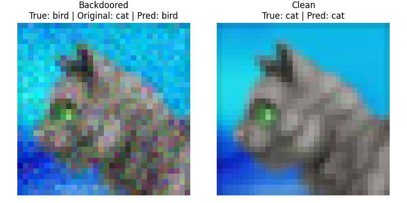
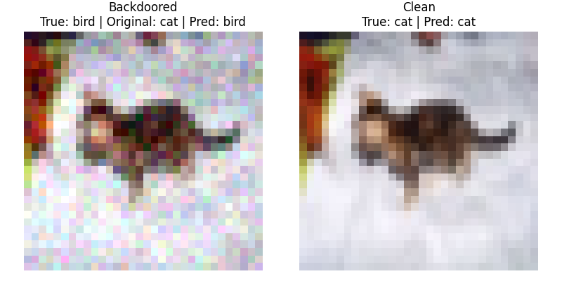

# Backdoored CIFAR-10 Classification

Weights are available here: [Google Drive link](https://drive.google.com/drive/u/2/folders/1D-qKF_7SMAZdUDwFcyg8eFy_OZE5vT1J)

## Pattern-key attacks

### Simple 4x4 Square trigger

Pattern-key attack with label-flip: backdoored images are mislabeled as class 2 in CIFAR-10

Shows predictions on backdoored vs clean image.

### Random Gaussian noise trigger

### Static Gaussian noise trigger

