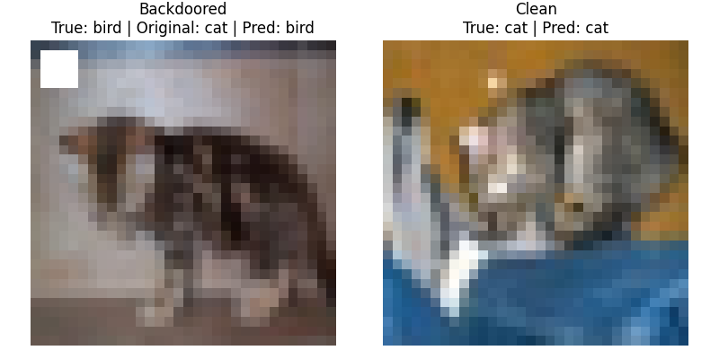

# Backdoored CIFAR-10 Classification

## Pattern-key attacks

### Simple 4x4 Square trigger

Pattern-key attack with label-flip: backdoored images are mislabeled as class 2 in CIFAR-10

Shows predictions on backdoored vs clean image.

